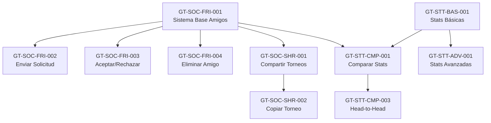

# Esquema Maestro de Funcionalidades - Golf Tracker

**Versión**: 2.0
**Fecha**: 24 de marzo de 2026
**Estado del Proyecto**: Versión 2.4.8 en Producción

---

## 📊 Índice

1. [Diagrama de Arquitectura de Features](#-diagrama-de-arquitectura-de-features)
2. [Resumen Ejecutivo](#-resumen-ejecutivo)
3. [Funcionalidades por Estado](#-funcionalidades-por-estado)
4. [Matriz de Clasificación](#-matriz-de-clasificación)
5. [Roadmap Visual](#-roadmap-visual)
6. [Plan de Planificación](#-plan-de-planificación)

---

## 🏗️ Diagrama de Arquitectura de Features

```
┌─────────────────────────────────────────────────────────────────────────────┐
│                          GOLF TRACKER - ARQUITECTURA                        │
└─────────────────────────────────────────────────────────────────────────────┘

┌───────────────────────────────────────────────────────────────────────────┐
│ CAPA DE USUARIO (USR)                                                     │
│ ┌─────────────┐  ┌─────────────┐  ┌─────────────┐  ┌─────────────┐      │
│ │   Perfil    │  │   Manager   │  │  Privacidad │  │    Auth     │      │
│ │  PRF (7)    │  │   MGR (5)   │  │   PRV (5)   │  │   AUT (7)   │      │
│ │             │  │             │  │             │  │             │      │
│ │ ✅ 3 impl.  │  │ ✅ 3 impl.  │  │ 🔮 futuro   │  │ ✅ 1 impl.  │      │
│ └─────────────┘  └─────────────┘  └─────────────┘  └─────────────┘      │
└───────────────────────────────────────────────────────────────────────────┘

┌───────────────────────────────────────────────────────────────────────────┐
│ CAPA DE TORNEOS (TRN)                                                     │
│ ┌─────────────┐  ┌─────────────┐  ┌─────────────┐                        │
│ │  Oficiales  │  │Personalizados│ │  Registro   │                        │
│ │  OFC (5)    │  │   CST (6)   │  │   REG (4)   │                        │
│ │             │  │             │  │             │                        │
│ │ ✅ 3 impl.  │  │ ✅ 3 impl.  │  │ 🔮 futuro   │                        │
│ └─────────────┘  └─────────────┘  └─────────────┘                        │
└───────────────────────────────────────────────────────────────────────────┘

┌───────────────────────────────────────────────────────────────────────────┐
│ CAPA DE RESULTADOS (RST)                                                  │
│ ┌─────────────┐  ┌─────────────┐  ┌─────────────┐                        │
│ │  Scorecard  │  │   Entrada   │  │  Historial  │                        │
│ │  SCR (8)    │  │   ENT (4)   │  │   HIS (5)   │                        │
│ │             │  │             │  │             │                        │
│ │ ✅ 2 impl.  │  │ 🔮 futuro   │  │ ✅ 2 impl.  │                        │
│ └─────────────┘  └─────────────┘  └─────────────┘                        │
└───────────────────────────────────────────────────────────────────────────┘

┌───────────────────────────────────────────────────────────────────────────┐
│ CAPA DE ESTADÍSTICAS (STT)                                                │
│ ┌─────────────┐  ┌─────────────┐  ┌─────────────┐  ┌─────────────┐      │
│ │   Básicas   │  │  Avanzadas  │  │ Comparación │  │Predicciones │      │
│ │  BAS (5)    │  │   ADV (10)  │  │   CMP (6)   │  │   PRD (3)   │      │
│ │             │  │             │  │             │  │             │      │
│ │ 🔮 futuro   │  │ 🔮 futuro   │  │ 🔮 futuro   │  │ 🔮 futuro   │      │
│ └─────────────┘  └─────────────┘  └─────────────┘  └─────────────┘      │
└───────────────────────────────────────────────────────────────────────────┘

┌───────────────────────────────────────────────────────────────────────────┐
│ CAPA SOCIAL (SOC)                                                         │
│ ┌─────────────┐  ┌─────────────┐  ┌─────────────┐                        │
│ │   Amigos    │  │  Compartir  │  │  Mensajería │                        │
│ │  FRI (10)   │  │   SHR (7)   │  │   MSG (3)   │                        │
│ │             │  │             │  │             │                        │
│ │ 🔮 futuro   │  │ 🔮 futuro   │  │ 🔮 futuro   │                        │
│ └─────────────┘  └─────────────┘  └─────────────┘                        │
└───────────────────────────────────────────────────────────────────────────┘

┌───────────────────────────────────────────────────────────────────────────┐
│ CAPA LIVE (LIV)                                                           │
│ ┌─────────────┐  ┌─────────────┐  ┌─────────────┐                        │
│ │  Compartir  │  │  Tracking   │  │    Clima    │                        │
│ │  SHR (7)    │  │   TRK (4)   │  │   WTH (4)   │                        │
│ │             │  │             │  │             │                        │
│ │ ✅ 2 impl.  │  │ 🔮 futuro   │  │ ✅ 1 impl.  │                        │
│ └─────────────┘  └─────────────┘  └─────────────┘                        │
└───────────────────────────────────────────────────────────────────────────┘

┌───────────────────────────────────────────────────────────────────────────┐
│ CAPA DE HANDICAP (HCP)                                                    │
│ ┌─────────────┐  ┌─────────────┐  ┌─────────────┐                        │
│ │Fetch/Update │  │  Cálculo    │  │  Historial  │                        │
│ │  FTC (6)    │  │   CLV (3)   │  │   HIS (3)   │                        │
│ │             │  │             │  │             │                        │
│ │ ✅ 4 impl.  │  │ 🔮 futuro   │  │ 🔮 futuro   │                        │
│ └─────────────┘  └─────────────┘  └─────────────┘                        │
└───────────────────────────────────────────────────────────────────────────┘

┌───────────────────────────────────────────────────────────────────────────┐
│ CAPA DE INFRAESTRUCTURA (INF)                                             │
│ ┌─────────────┐  ┌─────────────┐  ┌─────────────┐  ┌─────────────┐      │
│ │  Entornos   │  │   Flags     │  │    CI/CD    │  │  Monitoreo  │      │
│ │  ENV (5)    │  │   FLG (5)   │  │   CID (6)   │  │   MON (6)   │      │
│ │             │  │             │  │             │  │             │      │
│ │ 🔮 futuro   │  │ 🔮 futuro   │  │ 🔮 futuro   │  │ 🔮 futuro   │      │
│ └─────────────┘  └─────────────┘  └─────────────┘  └─────────────┘      │
└───────────────────────────────────────────────────────────────────────────┘

┌───────────────────────────────────────────────────────────────────────────┐
│ CAPA DE SEGURIDAD (SEC)                                                   │
│ ┌─────────────┐  ┌─────────────┐  ┌─────────────┐                        │
│ │  Firestore  │  │    Auth     │  │ Performance │                        │
│ │  FIR (6)    │  │   AUT (7)   │  │   PER (7)   │                        │
│ │             │  │             │  │             │                        │
│ │ 🔮 futuro   │  │ ✅ 1 impl.  │  │ 🔮 futuro   │                        │
│ └─────────────┘  └─────────────┘  └─────────────┘                        │
└───────────────────────────────────────────────────────────────────────────┘

┌───────────────────────────────────────────────────────────────────────────┐
│ CAPA DE INTERFAZ (UI)                                                     │
│ ┌─────────────┐  ┌─────────────┐  ┌─────────────┐                        │
│ │    Temas    │  │  Navegación │  │Accesibilidad│                        │
│ │  THM (3)    │  │   NAV (4)   │  │   ACC (4)   │                        │
│ │             │  │             │  │             │                        │
│ │ ✅ 1 impl.  │  │ ✅ 1 impl.  │  │ 🔮 futuro   │                        │
│ └─────────────┘  └─────────────┘  └─────────────┘                        │
└───────────────────────────────────────────────────────────────────────────┘

┌───────────────────────────────────────────────────────────────────────────┐
│ CAPA DE INTEGRACIONES (INT)                                               │
│ ┌─────────────┐  ┌─────────────┐  ┌─────────────┐                        │
│ │     GPS     │  │Federaciones │  │   Social    │                        │
│ │  GPS (3)    │  │   FED (4)   │  │   SOC (4)   │                        │
│ │             │  │             │  │             │                        │
│ │ 🔮 futuro   │  │ 🔮 futuro   │  │ ✅ 1 impl.  │                        │
│ └─────────────┘  └─────────────┘  └─────────────┘                        │
└───────────────────────────────────────────────────────────────────────────┘

Leyenda:
✅ = Implementado en producción
🔮 = Planificado para futuro
(N) = Número de features en la categoría
```

---

## 📈 Resumen Ejecutivo

### Estado Actual del Proyecto

| Métrica | Valor |
|---------|-------|
| **Total de Features Definidas** | 156 |
| **Features Implementadas** | 24 (15.4%) |
| **Features Planificadas** | 132 (84.6%) |
| **Categorías Principales** | 10 |
| **Subcategorías** | 30 |

### Distribución por Categoría

```
Categoría          | Total | ✅ Impl. | 🔮 Futuro | % Completado
-------------------|-------|----------|-----------|-------------
SOC (Social)       |   20  |    0     |    20     |     0%
LIV (Live)         |   15  |    3     |    12     |    20%
STT (Stats)        |   24  |    0     |    24     |     0%
RST (Resultados)   |   17  |    4     |    13     |    24%
TRN (Torneos)      |   15  |    6     |     9     |    40%
HCP (Handicap)     |   12  |    4     |     8     |    33%
USR (Usuario)      |   24  |    7     |    17     |    29%
SEC (Seguridad)    |   20  |    1     |    19     |     5%
INF (Infraestr.)   |   22  |    0     |    22     |     0%
UI (Interfaz)      |   11  |    2     |     9     |    18%
INT (Integración)  |   11  |    1     |    10     |     9%
-------------------|-------|----------|-----------|-------------
TOTAL              |  191  |   28     |   163     |  14.7%
```

---

## ✅ Funcionalidades por Estado

### 🟢 IMPLEMENTADAS (Producción)

#### LIVE (LIV) - 3 features
- ✅ `GT-LIV-SHR-001` - URL compartida con nombre del jugador
- ✅ `GT-LIV-SHR-002` - Suma de vueltas acumuladas (torneos 36 hoyos)
- ✅ `GT-LIV-WTH-001` - Clima actual del campo

#### HANDICAP (HCP) - 4 features
- ✅ `GT-HCP-FTC-001` - Scraping hándicap RFEG
- ✅ `GT-HCP-FTC-002` - Cache de hándicap
- ✅ `GT-HCP-FTC-003` - Auto-actualización diaria
- ✅ `GT-HCP-FTC-004` - Descargar PDF historial

#### USUARIO (USR) - 7 features
- ✅ `GT-USR-PRF-001` - Editar perfil básico
- ✅ `GT-USR-PRF-002` - Subir foto de perfil
- ✅ `GT-USR-PRF-003` - Fotos en Cloudflare R2
- ✅ `GT-USR-MGR-001` - Gestionar múltiples usuarios
- ✅ `GT-USR-MGR-002` - Switch entre usuarios
- ✅ `GT-USR-MGR-003` - Persistencia de usuario activo
- ✅ `GT-SEC-AUT-001` - Login con email/password

#### RESULTADOS (RST) - 4 features
- ✅ `GT-RST-SCR-001` - Editor scorecard básico
- ✅ `GT-RST-SCR-002` - Editor scorecard hoyo por hoyo
- ✅ `GT-RST-HIS-001` - Ver historial de resultados
- ✅ `GT-RST-HIS-002` - Filtrar por temporada

#### TORNEOS (TRN) - 6 features
- ✅ `GT-TRN-OFC-001` - Cargar torneos RFEG
- ✅ `GT-TRN-OFC-002` - Cargar torneos FCG
- ✅ `GT-TRN-OFC-005` - Filtros de torneos
- ✅ `GT-TRN-CST-001` - Crear torneo personalizado
- ✅ `GT-TRN-CST-002` - Editar torneo personalizado
- ✅ `GT-TRN-CST-003` - Eliminar torneo personalizado

#### INTERFAZ (UI) - 2 features
- ✅ `GT-UI-THM-003` - Colores de organización personalizables
- ✅ `GT-UI-NAV-001` - Navegación por tabs

#### INTEGRACIONES (INT) - 1 feature
- ✅ `GT-INT-SOC-003` - Compartir en WhatsApp (navigator.share)

---

### 🔵 PLANIFICADAS (Roadmap)

#### PRIORIDAD ALTA (Q2 2026)

##### Sistema de Amigos (SOC-FRI) - 10 features
- 🔴 `GT-SOC-FRI-001` - Sistema base de amigos (Firestore)
- 🔴 `GT-SOC-FRI-002` - Enviar solicitud de amistad
- 🔴 `GT-SOC-FRI-003` - Aceptar/Rechazar solicitud
- 🔴 `GT-SOC-FRI-004` - Eliminar amigo
- 🔴 `GT-SOC-FRI-005` - Buscar usuarios por username
- 🔴 `GT-SOC-FRI-006` - Buscar usuarios por email
- 🔴 `GT-SOC-FRI-007` - Generar QR de perfil
- 🔴 `GT-SOC-FRI-008` - Escanear QR para agregar amigo
- 🔴 `GT-SOC-FRI-009` - Notificaciones de solicitudes
- 🔴 `GT-SOC-FRI-010` - Contador de solicitudes pendientes

##### Compartir Torneos (SOC-SHR) - 7 features
- 🔴 `GT-SOC-SHR-001` - Compartir torneo con amigos
- 🔴 `GT-SOC-SHR-002` - Copiar torneo compartido
- 🔴 `GT-SOC-SHR-003` - Permisos de torneo compartido
- 🔴 `GT-SOC-SHR-004` - Revocar acceso a torneo
- 🔴 `GT-SOC-SHR-005` - Link público de torneo
- 🔴 `GT-SOC-SHR-006` - Compartir scorecard como imagen
- 🔴 `GT-SOC-SHR-007` - Compartir perfil público

##### Comparación de Estadísticas (STT-CMP) - 6 features
- 🔴 `GT-STT-CMP-001` - Comparar con amigos (básico)
- 🔴 `GT-STT-CMP-002` - Comparar con amigos (avanzado)
- 🔴 `GT-STT-CMP-003` - Head-to-head en torneos comunes
- 🔴 `GT-STT-CMP-004` - Ranking entre amigos
- 🔴 `GT-STT-CMP-005` - Gráficos radar comparativos
- 🔴 `GT-STT-CMP-006` - Exportar comparación a imagen/PDF

#### PRIORIDAD MEDIA (Q3-Q4 2026)

##### Estadísticas Básicas (STT-BAS) - 5 features
- 🟡 `GT-STT-BAS-001` - Promedio de score
- 🟡 `GT-STT-BAS-002` - Mejor/Peor resultado
- 🟡 `GT-STT-BAS-003` - Torneos jugados
- 🟡 `GT-STT-BAS-004` - Gráfico de evolución
- 🟡 `GT-STT-BAS-005` - Stats por campo

##### Live Tracking (LIV-TRK) - 4 features
- 🟡 `GT-LIV-TRK-001` - GPS tracking de posición
- 🟡 `GT-LIV-TRK-002` - Detección automática de hoyo
- 🟡 `GT-LIV-TRK-003` - Tiempo estimado de finalización
- 🟡 `GT-LIV-TRK-004` - Distancia restante al hoyo

##### Mejoras de Scorecard (RST-SCR) - 6 features
- 🟡 `GT-RST-SCR-003` - Autocompletado de pares
- 🟡 `GT-RST-SCR-004` - Importar scorecard de foto (OCR)
- 🟡 `GT-RST-SCR-005` - Validación de scores
- 🟡 `GT-RST-SCR-006` - Edición rápida swipe
- 🟡 `GT-RST-SCR-007` - Copiar scorecard anterior
- 🟡 `GT-RST-SCR-008` - Template de scorecard favorito

#### PRIORIDAD BAJA (2027+)

##### Estadísticas Avanzadas (STT-ADV) - 10 features
- ⚪ `GT-STT-ADV-001` - Strokes Gained (total)
- ⚪ `GT-STT-ADV-002` - Strokes Gained (driving)
- ⚪ `GT-STT-ADV-003` - Strokes Gained (approach)
- ⚪ `GT-STT-ADV-004` - Strokes Gained (putting)
- ⚪ `GT-STT-ADV-005` - Scrambling percentage
- ⚪ `GT-STT-ADV-006` - Sand save percentage
- ⚪ `GT-STT-ADV-007` - Driving accuracy
- ⚪ `GT-STT-ADV-008` - GIR percentage
- ⚪ `GT-STT-ADV-009` - Putts por GIR
- ⚪ `GT-STT-ADV-010` - Putts totales promedio

##### Mensajería (SOC-MSG) - 3 features
- ⚪ `GT-SOC-MSG-001` - Chat directo entre amigos
- ⚪ `GT-SOC-MSG-002` - Mensajes grupales
- ⚪ `GT-SOC-MSG-003` - Reacciones a resultados

##### Integraciones GPS (INT-GPS) - 3 features
- ⚪ `GT-INT-GPS-001` - Integración Garmin
- ⚪ `GT-INT-GPS-002` - Integración Bushnell
- ⚪ `GT-INT-GPS-003` - Integración SkyCaddie

---

## 🗂️ Matriz de Clasificación

### Por Tipo de Funcionalidad

| Tipo | Descripción | Features | % Total |
|------|-------------|----------|---------|
| **Core** | Funcionalidad básica del app | 35 | 18.3% |
| **Social** | Interacción entre usuarios | 30 | 15.7% |
| **Analytics** | Estadísticas y análisis | 39 | 20.4% |
| **Integración** | Servicios externos | 18 | 9.4% |
| **Infraestructura** | DevOps y sistemas | 39 | 20.4% |
| **UX/UI** | Interfaz y experiencia | 15 | 7.9% |
| **Seguridad** | Auth y permisos | 15 | 7.9% |

### Por Complejidad Técnica

| Complejidad | Features | Tiempo Promedio | Ejemplos |
|-------------|----------|-----------------|----------|
| **Baja** (1-2 días) | 45 | 1.5 días | GT-UI-THM-001, GT-RST-SCR-003 |
| **Media** (3-5 días) | 78 | 4 días | GT-SOC-FRI-002, GT-STT-BAS-001 |
| **Alta** (1-2 semanas) | 53 | 10 días | GT-SOC-FRI-001, GT-STT-ADV-001 |
| **Muy Alta** (3+ semanas) | 15 | 20 días | GT-INT-GPS-001, GT-INF-CID-002 |

### Por Dependencias



---

## 🗓️ Roadmap Visual

### Timeline 2026-2027

```
2026 Q2                  2026 Q3                  2026 Q4                  2027 Q1
│                        │                        │                        │
├─ Sistema de Amigos     ├─ Stats Básicas        ├─ Stats Avanzadas       ├─ Mensajería
│  (GT-SOC-FRI)          │  (GT-STT-BAS)          │  (GT-STT-ADV)          │  (GT-SOC-MSG)
│  📅 6 semanas          │  📅 4 semanas          │  📅 8 semanas          │  📅 6 semanas
│                        │                        │                        │
├─ Compartir Torneos     ├─ Live Tracking        ├─ Integraciones GPS     ├─ CI/CD
│  (GT-SOC-SHR)          │  (GT-LIV-TRK)          │  (GT-INT-GPS)          │  (GT-INF-CID)
│  📅 3 semanas          │  📅 4 semanas          │  📅 6 semanas          │  📅 4 semanas
│                        │                        │                        │
├─ Comparar Stats        ├─ Mejoras Scorecard    ├─ Feature Flags         ├─ Monitoreo
│  (GT-STT-CMP)          │  (GT-RST-SCR)          │  (GT-INF-FLG)          │  (GT-INF-MON)
│  📅 4 semanas          │  📅 3 semanas          │  📅 2 semanas          │  📅 3 semanas
│                        │                        │                        │
└────────────────────────┴────────────────────────┴────────────────────────┴────────────

Hitos Clave:
🎯 Abril 2026: Lanzamiento Sistema de Amigos
🎯 Julio 2026: Lanzamiento Estadísticas Básicas
🎯 Octubre 2026: Lanzamiento Estadísticas Avanzadas
🎯 Enero 2027: Lanzamiento Mensajería y CI/CD
```

---

## 📋 Plan de Planificación

### Metodología de Desarrollo

#### Ciclos de Sprint (2 semanas)

```
Sprint Planning         Daily Standup          Sprint Review          Sprint Retro
      ↓                        ↓                      ↓                     ↓
┌─────────────┐         ┌─────────────┐         ┌─────────────┐      ┌─────────────┐
│ Seleccionar │         │  Progreso   │         │   Demo      │      │  Mejoras    │
│  Features   │  ────>  │   Diario    │  ────>  │ Features    │ ──>  │  Proceso    │
│  del Roadmap│         │  15 min     │         │  (1 hora)   │      │  (1 hora)   │
└─────────────┘         └─────────────┘         └─────────────┘      └─────────────┘
      │                                                                      │
      └──────────────────────────────────────────────────────────────────────┘
                              Siguiente Sprint
```

#### Definition of Done (DoD)

Para marcar una feature como ✅ **IMPLEMENTADA**, debe cumplir:

1. ✅ Código escrito y revisado (Code Review)
2. ✅ Tests unitarios (mínimo 80% coverage)
3. ✅ Tests de integración
4. ✅ Documentación actualizada
5. ✅ Feature flag creado (si aplica)
6. ✅ Probado en Staging
7. ✅ Aprobado por Product Owner
8. ✅ Desplegado en Producción
9. ✅ Monitoreo activo (sin errores críticos)

### Proceso de Feature Development

```
1. PLANIFICACIÓN (GT-XXX-XXX-001)
   │
   ├─ Crear issue en GitHub
   ├─ Asignar código de feature
   ├─ Definir criterios de aceptación
   ├─ Estimar tiempo (Fibonacci: 1, 2, 3, 5, 8, 13)
   └─ Identificar dependencias

2. DISEÑO
   │
   ├─ Schema de Firestore (si aplica)
   ├─ Mockups de UI (Figma)
   ├─ Diagrama de flujo
   └─ Review técnico

3. DESARROLLO
   │
   ├─ Crear branch: feature/GT-XXX-XXX-001
   ├─ Implementar código
   ├─ Escribir tests
   ├─ Feature flag (deshabilitado en prod)
   └─ Commit: feat(GT-XXX-XXX-001): descripción

4. TESTING
   │
   ├─ Tests unitarios (Jest)
   ├─ Tests E2E (Playwright)
   ├─ Testing manual en Staging
   └─ Performance testing

5. DEPLOY
   │
   ├─ PR a main
   ├─ Code review
   ├─ CI/CD automático
   ├─ Deploy a Staging
   ├─ Habilitar feature flag en Staging
   ├─ QA en Staging
   ├─ Deploy a Production
   └─ Rollout gradual (10% → 50% → 100%)

6. MONITOREO
   │
   ├─ Sentry (errores)
   ├─ Firebase Analytics (uso)
   ├─ Performance metrics
   └─ Feedback de usuarios
```

### Priorización de Features

#### Framework RICE

**RICE Score = (Reach × Impact × Confidence) / Effort**

| Feature | Reach | Impact | Confidence | Effort | RICE | Prioridad |
|---------|-------|--------|------------|--------|------|-----------|
| GT-SOC-FRI-001 | 100% | 3 | 80% | 13 | **18.5** | 🔴 Alta |
| GT-STT-CMP-001 | 80% | 3 | 70% | 8 | **16.8** | 🔴 Alta |
| GT-SOC-SHR-001 | 90% | 2 | 90% | 5 | **32.4** | 🔴 Alta |
| GT-STT-BAS-001 | 100% | 2 | 100% | 5 | **40.0** | 🔴 Alta |
| GT-LIV-TRK-001 | 60% | 2 | 50% | 13 | **4.6** | 🟡 Media |
| GT-STT-ADV-001 | 40% | 3 | 40% | 13 | **3.7** | 🟡 Media |
| GT-SOC-MSG-001 | 50% | 2 | 60% | 8 | **7.5** | 🟡 Media |
| GT-INT-GPS-001 | 30% | 2 | 30% | 20 | **0.9** | ⚪ Baja |

**Criterios**:
- **Reach**: % de usuarios afectados (0-100%)
- **Impact**: Impacto en usuario (1=bajo, 2=medio, 3=alto)
- **Confidence**: % de confianza en estimaciones (0-100%)
- **Effort**: Esfuerzo en story points (1-20)

---

## 🎯 Objetivos Q2 2026 (Próximos 3 meses)

### Sprint 1-2 (Abril): Sistema de Amigos
**Objetivo**: Lanzar sistema completo de amigos

- [ ] GT-SOC-FRI-001: Sistema base *(2 semanas)*
- [ ] GT-SOC-FRI-002: Enviar solicitud *(2 días)*
- [ ] GT-SOC-FRI-003: Aceptar/Rechazar *(2 días)*
- [ ] GT-SOC-FRI-004: Eliminar amigo *(1 día)*
- [ ] GT-SOC-FRI-005: Buscar por username *(3 días)*
- [ ] GT-SOC-FRI-009: Notificaciones *(3 días)*

**Entregable**: Módulo de Amigos funcional en producción

### Sprint 3-4 (Mayo): Compartir y Comparar
**Objetivo**: Funcionalidades sociales básicas

- [ ] GT-SOC-SHR-001: Compartir torneos *(1 semana)*
- [ ] GT-SOC-SHR-002: Copiar torneos *(3 días)*
- [ ] GT-STT-CMP-001: Comparar stats básico *(1 semana)*
- [ ] GT-STT-CMP-003: Head-to-head *(4 días)*

**Entregable**: Features sociales completas

### Sprint 5-6 (Junio): Estadísticas Básicas
**Objetivo**: Panel de estadísticas personales

- [ ] GT-STT-BAS-001: Promedio de score *(2 días)*
- [ ] GT-STT-BAS-002: Mejor/Peor resultado *(1 día)*
- [ ] GT-STT-BAS-003: Torneos jugados *(1 día)*
- [ ] GT-STT-BAS-004: Gráfico de evolución *(1 semana)*
- [ ] GT-STT-BAS-005: Stats por campo *(3 días)*

**Entregable**: Panel de estadísticas v1.0

---

## 📊 Métricas de Seguimiento

### KPIs de Desarrollo

| Métrica | Objetivo | Actual |
|---------|----------|--------|
| **Velocity** (story points/sprint) | 20-25 | TBD |
| **Lead Time** (días idea→producción) | < 21 días | TBD |
| **Cycle Time** (días dev→producción) | < 7 días | TBD |
| **Code Coverage** | > 80% | TBD |
| **Bug Rate** (bugs/feature) | < 2 | TBD |
| **Feature Adoption** (% usuarios) | > 60% | TBD |

### Dashboard de Progreso

```
Funcionalidades Implementadas: ████████████░░░░░░░░░░░░░░░░░░░░  24/156 (15.4%)

Por Categoría:
SOC (Social):       ░░░░░░░░░░░░░░░░░░░░░░░░░░░░░░   0/20 (0%)
LIV (Live):         ████░░░░░░░░░░░░░░░░░░░░░░░░░░   3/15 (20%)
STT (Stats):        ░░░░░░░░░░░░░░░░░░░░░░░░░░░░░░   0/24 (0%)
RST (Resultados):   ████████░░░░░░░░░░░░░░░░░░░░░░   4/17 (24%)
TRN (Torneos):      ████████████░░░░░░░░░░░░░░░░░░   6/15 (40%)
HCP (Handicap):     ████████████░░░░░░░░░░░░░░░░░░   4/12 (33%)
USR (Usuario):      ██████████░░░░░░░░░░░░░░░░░░░░   7/24 (29%)
```

---

## 🔍 Búsqueda Rápida de Features

### Por Archivo de Código

| Archivo | Features Implementadas | Códigos |
|---------|----------------------|---------|
| `CalendarView.jsx` | 5 | GT-LIV-SHR-001, GT-LIV-SHR-002, GT-TRN-CST-001/002/003 |
| `PublicScorecardView.jsx` | 2 | GT-LIV-SHR-001, GT-LIV-SHR-002 |
| `HandicapView.jsx` | 4 | GT-HCP-FTC-001/002/003/004 |
| `LoginViewFirebase.jsx` | 1 | GT-SEC-AUT-001 |
| `ResultsView.jsx` | 2 | GT-RST-HIS-001, GT-RST-HIS-002 |
| `MobileScorecardEditor.jsx` | 2 | GT-RST-SCR-001, GT-RST-SCR-002 |
| `userProfiles.js` | 3 | GT-USR-PRF-001/002/003 |
| `AdminDashboardView.jsx` | 3 | GT-USR-MGR-001/002/003 |

---

## 📚 Documentos Relacionados

- [ROADMAP_FEATURES.md](ROADMAP_FEATURES.md) - Detalles técnicos de features futuras
- [CODIGOS_FEATURES.md](CODIGOS_FEATURES.md) - Sistema completo de códigos
- [PLAN_MAESTRO.md](PLAN_MAESTRO.md) - Plan maestro de migración y arquitectura
- [PLAN_ESCALABILIDAD.md](PLAN_ESCALABILIDAD.md) - Estrategia de escalabilidad

---

**Última actualización**: 24 de marzo de 2026
**Versión**: 2.0
**Autor**: Reinaldo Moon
**Revisado por**: Claude (Asistente IA)
